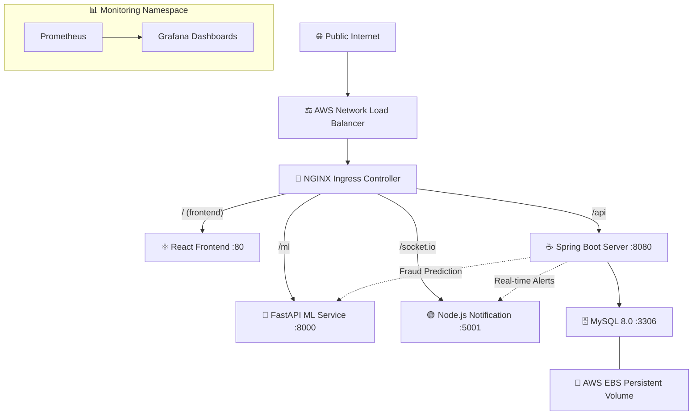

# InsuranceIQ: AI-Powered Claims Management Platform

InsuranceIQ provides the core infrastructure for a highly scalable, intelligent insurance and claims management platform. Built on a distributed microservices architecture (Java Spring Boot, React, Python FastAPI, and Node.js), it delivers robust, decoupled services to handle essential insurance operations, real-time fraud detection, and automated notifications effectively.

---

### Architecture

---

### Tech Stack

| Layer | Technology | Version |
|---|---|---|
| **Frontend** | React, Vite, TailwindCSS, Recharts, Axios, Socket.io-client | React 19, Vite 8 |
| **Backend API** | Spring Boot, Spring Security, Spring Data JPA, Lombok, JWT (jjwt) | Spring Boot 3.2.5, Java 17 |
| **ML Service** | FastAPI, Scikit-learn, Pandas, NumPy, SQLAlchemy, Pydantic | Python 3.10+ |
| **Notification** | Node.js, Express, Socket.IO, MySQL2, node-cron, Helmet | Node 18+ |
| **Database** | MySQL Community Server | 8.0 |
| **API Docs** | Springdoc OpenAPI (Swagger UI) | 2.3.0 |
| **Container Runtime** | Docker, containerd | Latest |
| **Orchestration** | AWS EKS (Kubernetes), eksctl | EKS v1.34 |
| **Networking** | NGINX Ingress Controller, AWS NLB | Latest |
| **CI/CD** | Jenkins (Pipeline as Code via Groovy Jenkinsfile) | Latest |
| **Registry** | AWS Elastic Container Registry (ECR) | — |
| **Storage** | AWS EBS CSI Driver, gp2 StorageClass | — |
| **Monitoring** | Prometheus, Grafana (kube-prometheus-stack via Helm) | Latest |

---

### Implemented Modules
- **Claims Module (Spring Boot):** Manages the entire lifecycle of an insurance claim via RESTful CRUD APIs. Uses Spring Data JPA with MySQL for persistence and fires real-time WebSocket events on status transitions.
- **Fraud Detection Module (FastAPI/Scikit-learn):** Serves a trained ML model via a `/predict/fraud/{id}` endpoint. Accepts claim metadata, runs feature extraction, and returns a fraud probability score with a risk classification.
- **User & Agent Module (Spring Boot/Spring Security):** Handles JWT-based authentication and role-based access control (RBAC). Manages customer KYC profiles and agent assignments with input validation via `spring-boot-starter-validation`.
- **Notification Module (Node.js/Socket.IO):** Maintains persistent WebSocket connections per user session. Listens for internal events (`claim-filed`, `fraud-alert`, `claim-settled`) via REST and broadcasts real-time push notifications.
- **Analytics Module (React/Recharts):** Aggregates cross-service data from the Spring Boot and ML APIs into interactive dashboards with pie charts, bar charts, and stat cards for executive-level observability.

---

### Testing

| Module | Framework | Run Command |
|---|---|---|
| **Claims Service** | JUnit 5, Mockito | `mvn test` |
| **Fraud Detection** | Pytest, HTTPX TestClient | `pytest` |
| **Notification API** | Jest, Supertest | `npm test` |
| **Analytics Dashboard** | Vitest, React Testing Library, jsdom | `npm test` |

- **Claims Module Tests (JUnit 5/Mockito):** Verifies ClaimService business logic using mocked repositories. Covers CRUD operations, `ResourceNotFoundException` edge cases, notification event firing, and status transition callbacks.
- **Fraud Detection Tests (Pytest/HTTPX):** Validates the FastAPI health endpoints, fraud prediction inference on non-existent claims, and analytics distribution queries using the built-in TestClient.
- **Notification Tests (Jest/Supertest):** Tests the Express app in isolation with a mocked MySQL pool. Asserts health check responses, JWT-protected route rejection (401), internal event endpoint validation, and 404 fallback handling.
- **Analytics Dashboard Tests (Vitest/RTL):** Renders the FraudDetectionReport component with mocked API responses. Validates loading spinner, data rendering, stat card values, and graceful empty-state handling.

---

### System Prerequisites
- Java Development Kit (JDK 17+)
- Node.js (v18+) & NPM
- Python 3.10+
- Apache Maven
- MySQL Database Server (8.0+)
- Docker & Kubernetes (AWS EKS or local K3s for orchestration)
- NGINX Ingress Controller
- Helm (for Prometheus/Grafana monitoring stack)
- AWS CLI v2 (configured with IAM credentials)
